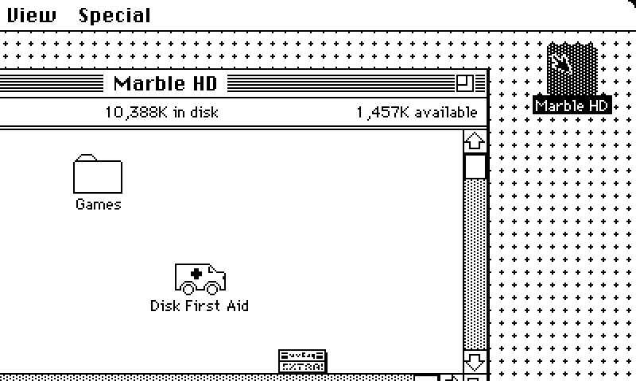
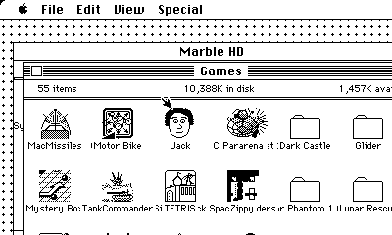
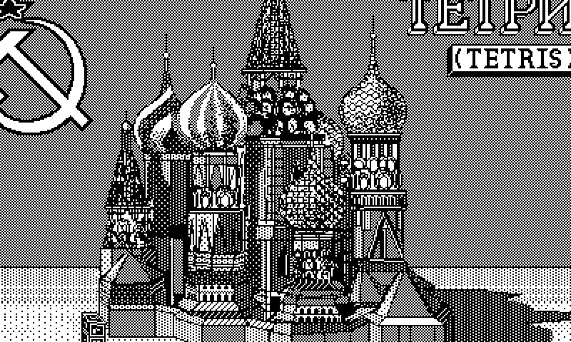

# Marble Mac

For the [Playdate](https://play.date). Load it up and find out.





## Building

You'll need the Playdate SDK, CMake, and Arm's GNU toolchain
(`build.sh` looks in `/Applications/ArmGNUToolchain`, since Homebrew's
`arm-none-eabi-gcc` ships without a C library).

Apple's ROM and system software aren't included. Put these in `Source/`
before building:

- `rom.bin`: a Mac Plus **v3** ROM (128K, checksum `4D1F8172`). Other
  ROMs won't work.
- `disk.img`: a raw boot disk image (the first two bytes are `LK`; strip
  any DiskCopy or emulator header). System 6 works well.
  `tools/make_disk.py` can build one from a folder of System and app
  disk images (`pip install machfs` first).

Then:

```
./build.sh          # simulator + device -> marblemac.pdx
```

You can also put `rom.bin` / `disk.img` in the game's Data folder on the
device, and those win over the bundled ones. Anything the Mac writes goes
to `disk.ovl` in the same folder; delete it to get a fresh disk.

## Credits

Marble Mac stands on other people's work:

- [uMac](https://github.com/evansm7/umac) by Matt Evans (MIT), the Mac
  Plus emulator underneath, vendored in `external/umac` with small changes.
- [Musashi](https://github.com/kstenerud/Musashi) by Karl Stenerud (MIT),
  the 68000 core inside uMac.
- uMac's disc driver is based on
  [Basilisk II](https://github.com/cebix/macemu), Copyright 1997–2008
  Christian Bauer (GPLv2), and its keymaps on
  [Mini vMac](https://www.gryphel.com/c/minivmac/) by Paul C. Pratt and
  others (GPLv2). Mini vMac is also where the absolute-mouse trick comes
  from.
- [Unicorn](https://www.unicorn-engine.org) runs the JIT's lockstep
  checker in `tools/jit` (a development tool, not part of the game).
- The Playdate SDK is by Panic.

See `external/umac/README.md` and `external/umac/external/Musashi/readme.txt`
for their licences.

## AI disclosure

Almost all of the code outside `external/` (the Playdate frontend, the
68k-to-Thumb-2 JIT, the sound and effects, and the test tools), plus the
changes inside `external/umac`, was written by Claude, Anthropic's AI
model, working in Claude Code. A human came up with the idea, steered
it, and tested it on real hardware. The screenshots come from the
headless host build in `tools/host_cursor.c`.
